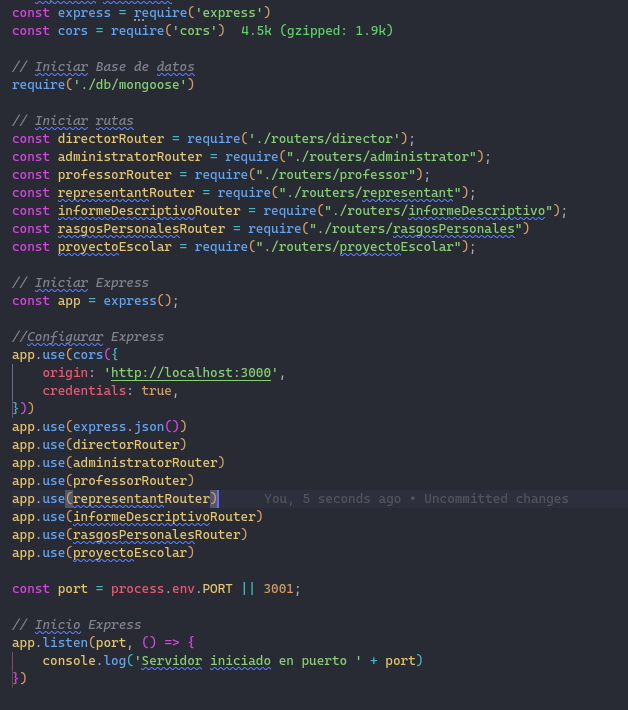

# School Project

This is school project made in react for a front end request made with a custom admin scss design.

## Available Scripts

In the project directory, you can run:

### `npm install`

To install dependencies. Next you can run.

### `npm start`

Runs the app in the development mode.\
Open [http://localhost:3000](http://localhost:3000) to view it in your browser.

The page will reload when you make changes.\
You may also see any lint errors in the console.

## (Spanish Instructions)

### Backend:

1. Instala las depencias con el comando `npm install`.
2. Instalar la libreria `cors` con el comando `npm install cors` para permitir al backend interacturar con las peticiones del cliente frontend.
3. Verificar que el archivo del backend `index.js` contenga la siguiente estructura. Visualizar la importacion del a libreria cors asi como el uso de la libreria corse por la instacia de express. `app.use(cors())` con las configuraciones que se muestran en la imagen
   
4. Validar que el puerto utilizado por el backend sea `3001` de lo contrario cambiar en el `composer.json` del frontend el comando `proxy:` al puerto que este ejecutando el backend.

### FrontEnd:

1. Instala las depencias con el comando `npm install`.
2. Registra un Director utiliznado la url base + register ejemplo: `http://localhost:3000/register`.
